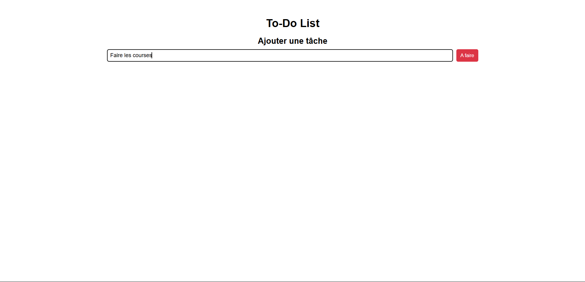
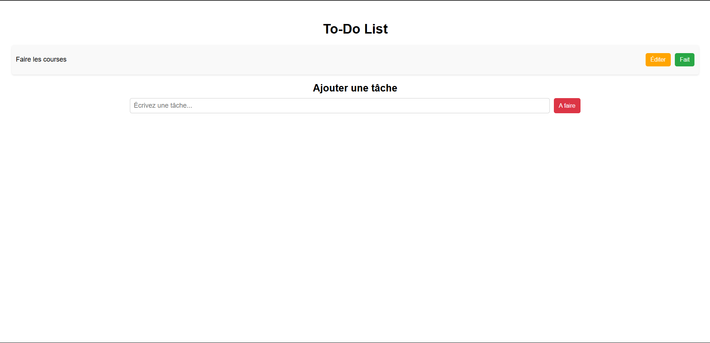
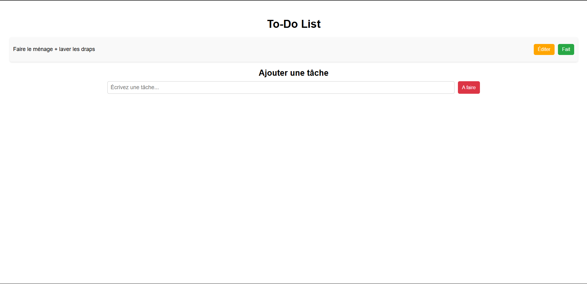

# Projet_container

## Objectif

Nous avons développé une application web composée de plusieurs services conteneurisés. Ce projet en groupe nous a permis de comprendre comment créer, containeriser, et orchestrer des services avec Docker et Docker Compose. NOus avons également été amenés à gérer les interactions entre les différents services.

## Description du projet

Notre application est composée de 3 éléments majeurs :

- une API REST nous permettant de gérer nos données (tâches à réaliser dans une To-Do List) ;
- une base de données relationnelle MySQL ;
- une interface utilisateur permettant l'interaction avec l'API pour afficher, ajouter, modifier et supprimer des données.

## Contraintes du projet

Pour ce projet, nous avons utilisé les technologies suivantes :

- Node.js pour le backend ;
- MySQL pour la base de données ;
- HTML/CSS/JS pour le frontend.

De plus, nous avons conteneurisé nos services en utilisant des Dockerfile spécifiques, tout en orchestrant l'ensemble de l'application avec un fichier docker-compose.yml.

Au niveau du backend, notre application possède 4 endpoints : POST, GET, PUT et DELETE. L'utilisateur peut directement interagir avec ces endpoints depuis le frontend.

## Etapes de réalisation

Nous avons tout d'abord commencé par choisir le thème de notre application CRUD, à savoir un gestionnaire de tâches **To-Do List**. Nous avons choisi d'implémenter 4 fonctionnalités principales : l'affichage des tâches (GET), l'ajout de tâche (POST), la modification de tâche (PUT) et la suppression de tâche (DELETE).

Une fois l'application entièrement fonctionnelle, nous avons créé les éléments Dockerfile (3), communiquant entre eux, et docker-compose.yml pour la dockeriser.

## Comment exécuter notre application

Une fois le projet téléchargé, réalisez les étapes suivantes dans le terminal :

```
cd .\client\
npm install
npm run build

cd ..\server\
npm install
npm install mysql2
npm install dotenv

cd ..
docker-compose up --build
```

Dans Docker, en vous plaçant dans le dossier du projet, si les conteneurs database-1 et node-1 ne se lancent pas, faites :

```
docker restart projet_container-database-1
docker restart projet_container-node-1
```

Vous pouvez maintenant avoir accès à l'application sur : http://localhost:80.

## Exemple d'utilisation de notre application
*Se référer aux images du dossier "images".*

Lorsque vous lancez l'application pour la première fois, vous devriez arriver sur l'application avec une tâche déjà référencée.
Pour la démonstration suivante, nous l'avons supprimée, donc vous devriez voir :


Pour ajouter une tâche à la To-Do list, il suffit simplement de rédiger ce que vous souhaitez, puis de cliquer sur le bouton 'À faire' : 



Une fois votre tâche ajoutée, vous devriez avoir :



Ajoutons une deuxième tâche pour mieux illustrer :


Si vous souhaitez modifier une tâche, cliquez simplement sur 'Editer' pour modifier son contenu :


Nous pouvons constater que la modification a bien été effectuée après avoir sauvegardé :


Une fois votre tâche terminée, vous avez la possibilité de la supprimer en cliquant sur 'Fait' :


